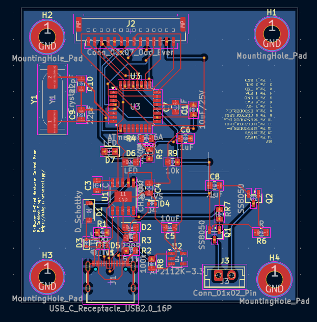
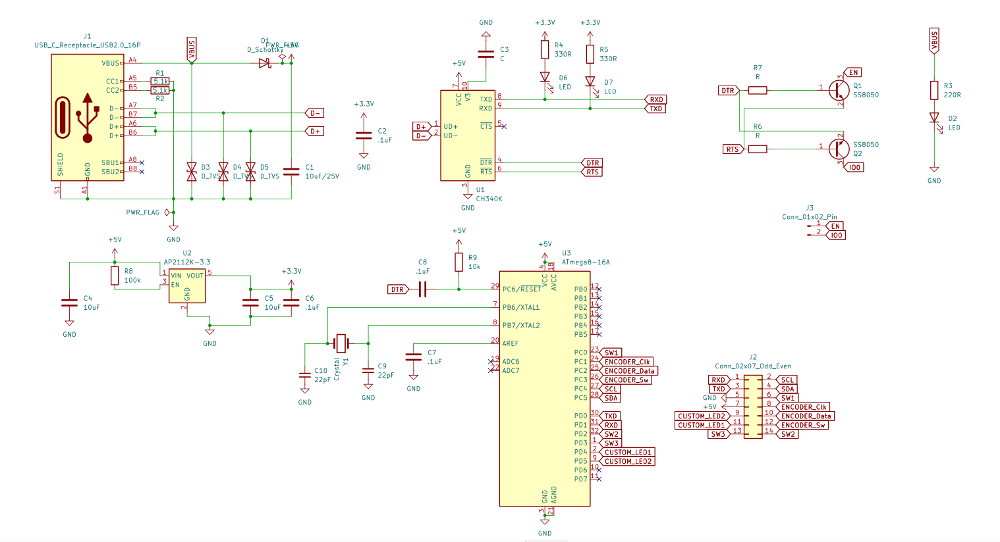

# Software-Defined Hardware Control Panel (SDH-CP)

An integrated, multi-interface hardware control platform that bridges physical inputs, microcontrollers, desktop GUIs, and web services. The project features an **Arduino-based firmware** with a rotary encoder and I2C OLED display, a **KiCad PCB design**, a **Python Tkinter Desktop GUI** featuring a background **Flask REST API**, and a **MATLAB dashboard**.

---

## Repository Structure

```directory
├── Software-Defined Hardware Control Panel/ # KiCad PCB & Schematic Design Files
│   ├── Software-Defined Hardware Control Panel.kicad_sch  # KiCad Schematic
│   ├── Software-Defined Hardware Control Panel.kicad_pcb  # KiCad PCB Layout
│   └── bom/
│       └── ibom.html                                       # Interactive Bill of Materials (iBOM)
├── src/                                     # Arduino C++ Firmware Source
│   ├── main.cpp                             # Main firmware loop and state machine
│   ├── helpers.cpp                          # RAM and hardware utility helpers
│   └── helpers.h                            # Circular Parameter Store class definitions
├── lib/                                     # Custom Hardware Libraries
│   └── ssd1306_128x64_i2c/                  # Optimized SSD1306 OLED display driver
├── include/                                 # PlatformIO headers directory
├── platformio.ini                           # PlatformIO Project Configuration
├── writeCommand.py                          # Python Tkinter GUI & Flask REST API Service
├── arduinoAMC.mlapp                         # MATLAB App Designer control panel/dashboard
├── package.json                             # Node.js dependencies (serialport tools)
└── README.md                                # Project Documentation (This file)
```

---

## Key Features

### Firmware (Arduino Uno + C++)
- **Dynamic Parameter Store**: Manages up to 5 runtime parameters (e.g., setpoints, configuration coefficients) with safety bounds (minimum and maximum).
- **Dual Display Modes**:
  - `MODE_FULL`: Shows the parameter name, current value, visual progress bar, and active connected software name.
  - `MODE_RAPID`: Switches to large-format value-only rendering during quick rotary encoder scrolls, reducing display redraw lag and maximizing responsiveness.
- **Hardware Integration**: Uses interrupt/tick-based rotary encoder tracking and switch inputs.
- **Real-Time Remote Control**: Provides a clean CSV-style serial communication protocol running at 9600 baud.

### Python GUI & REST API Daemon (writeCommand.py)
- **Desktop Console**: Multi-tab GUI for adding, reading, and updating parameters in real time. Contains a live serial traffic log and manual serial command terminal.
- **On-Demand Pin Reader**: Direct interface to read analog (A0-A5) and digital (D2-D13) pins on the fly.
- **REST API Backend**: Exposes a background Flask HTTP server on port `5000` to allow web apps or script automation to read and modify hardware states over simple network requests.

### Hardware Design (KiCad)
- Complete schematic and PCB design files for a dedicated control panel shield/device.
- **Interactive BOM (iBOM)** included (`ibom.html`) for easy assembly and soldering.

#### Hardware Gallery

| PCB 3D Render | PCB Routing |
| :---: | :---: |
|  |  |

| Schematic Diagram |
| :---: |
|  |

### MATLAB Integration (arduinoAMC.mlapp)
- Companion app for control, automation, and visualization of parameter values directly in MATLAB.

---

## Serial Communication Protocol

The Arduino firmware communicates with host computers via **9600 baud serial connection**. Messages use a command-response format:

### Host Commands (Commands sent to Arduino)

| Command Format | Description | Example |
| :--- | :--- | :--- |
| `add:param,<name>,<min>,<max>,<cur>` | Register/Overwrite a parameter in the store | `add:param,Gain,0,100,50` |
| `get:paramCurval,<name>` | Query the current value of a parameter | `get:paramCurval,Gain` |
| `update:paramsCurval,<name>,<val>` | Force-update a parameter value | `update:paramsCurval,Gain,65` |
| `get:AlladdedParams` | List all parameters in the store | `get:AlladdedParams` |
| `set:software,<name>` | Display active host software on the OLED | `set:software,MATLAB_App` |
| `read:digital,<pin>` | Set digital `<pin>` to input and read state | `read:digital,7` |
| `read:analog,<index>` | Read analog pin value (A0 + `<index>`) | `read:analog,0` |

### Arduino Responses & Broadcasts

| Response Prefix | Meaning | Format / Response Example |
| :--- | :--- | :--- |
| `A,<name>` | Parameter successfully added | `A,Gain` |
| `U,<name>,<val>` | Parameter updated (via encoder or serial command) | `U,Gain,65` |
| `S,<index>,<name>,<val>` | Active parameter selection cycled (via button press) | `S,0,Gain,65` |
| `G,<name>,<val>` | Parameter query result | `G,Gain,65` |
| `L,<idx>,<name>,<min>,<max>,<val>` | Parameter listing detail | `L,0,Gain,0,100,65` |
| `D,<pin>,<val>` | Digital pin read result | `D,7,1` |
| `A,<index>,<val>` | Analog pin read result | `A,0,512` |
| `ERR,<message>` | Command processing error | `ERR,Unknown command` |

---

## REST API Documentation

When running `writeCommand.py`, a Flask API server starts automatically at `http://localhost:5000`.

### Endpoints

#### 1. Get All Parameters
- **URL**: `/parameters`
- **Method**: `GET`
- **Response Example**:
  ```json
  {
    "Gain": {
      "index": "0",
      "min": "0",
      "max": "100",
      "current": 65
    }
  }
  ```

#### 2. Get Single Parameter
- **URL**: `/parameter/<name>`
- **Method**: `GET`
- **Response Example**:
  ```json
  {
    "Gain": {
      "index": "0",
      "min": "0",
      "max": "100",
      "current": 65
    }
  }
  ```

#### 3. Add Parameter
- **URL**: `/parameters`
- **Method**: `POST`
- **Headers**: `Content-Type: application/json`
- **Payload**:
  ```json
  {
    "name": "Frequency",
    "min": 10,
    "max": 1000,
    "current": 100
  }
  ```
- **Response**: `{"status": "Command sent", "command": "..."}`

#### 4. Update Parameter Value
- **URL**: `/parameter/<name>`
- **Method**: `PUT`
- **Headers**: `Content-Type: application/json`
- **Payload**:
  ```json
  {
    "new_value": 75
  }
  ```
- **Response**: `{"status": "Command sent", "command": "..."}`

#### 5. Send Raw Serial Command
- **URL**: `/command`
- **Method**: `POST`
- **Payload**: `{"command": "read:analog,0"}`
- **Response**: `{"status": "Command sent", "command": "..."}`

#### 6. Set Active Software Name
- **URL**: `/software`
- **Method**: `POST`
- **Payload**: `{"software_name": "API_Client"}`

#### 7. Retrieve Live GUI Console Log
- **URL**: `/log`
- **Method**: `GET`
- **Response**: `{"log": "..."}`

---

## Setup and Installation

### 1. Hardware Assembly
- Open the KiCad project files inside `Software-Defined Hardware Control Panel/` in KiCad.
- Reference the interactive BOM under `bom/ibom.html` for component lists and layout locations.
- Connect an I2C SSD1306 OLED screen to pins `SDA` (A4) and `SCL` (A5) of your Arduino.
- Connect a Rotary Encoder:
  - CLK to Pin 3 (Interrupt enabled)
  - DT to Pin 4
  - Push Button to Pin 2 (Interrupt/cycle pin)

### 2. Firmware Installation (VS Code + PlatformIO)
1. Open the project folder in VS Code with the **PlatformIO IDE** extension installed.
2. PlatformIO will fetch dependencies (`mathertel/RotaryEncoder`, `bblanchon/ArduinoJson`) automatically.
3. Build and upload:
   ```bash
   pio run --target upload
   ```

### 3. Desktop GUI & REST API Setup
Install python dependencies:
```bash
pip install pyserial flask
```
Identify your Arduino serial port (e.g. `/dev/ttyUSB0` on Linux or `COM3` on Windows). Update the default port at the bottom of `writeCommand.py` or launch the script:
```bash
python writeCommand.py
```

### 4. MATLAB Integration
- Launch MATLAB.
- Double-click and open `arduinoAMC.mlapp` in the App Designer to run the companion dashboard.

---

> [!NOTE]
> Ensure that no other program (such as VS Code Serial Monitor or MATLAB) is occupying the serial port when executing `writeCommand.py`, as only one application can hold the serial connection handle at a time.
